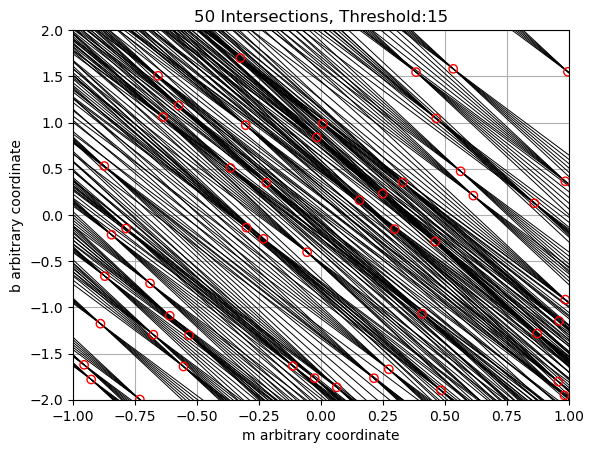
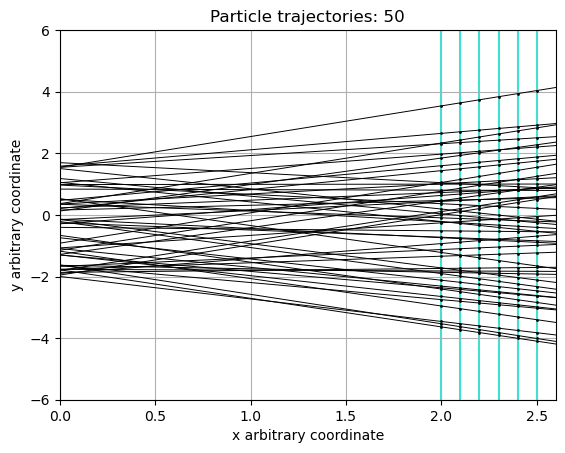

# Particle Track Reconstruction using Hough Transform

This project implements a computational algorithm to reconstruct particle trajectories from detector data using the Hough Transform.

## Overview

- Simulated particle trajectories crossing a multi-plane detector
- Implemented Hough Transform for pattern recognition
- Developed voting-based system to identify valid trajectories
- Analysed algorithm performance under noise and detector inefficiencies

## Key Concepts

- Mathematical modelling of trajectories 
- Noise and efficiency modelling
- Histogram-based voting system

## Results

### Hough Space Representation

### Detected Particle Trajectories

The algorithm shows high accuracy in ideal scenarios, but performance depends strongly on:

- Detector efficiency  
- Noise levels  
- Parameter tuning (bins, thresholds)  

## Technologies

- Python
- NumPy
- Simulation & statistical analysis

## Author

Arturo Hiram Benavides Figueroa
